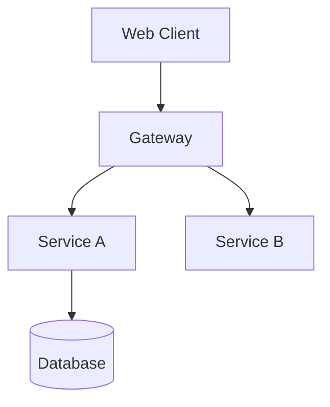

# Document Templates

## .context/CONTEXT.md Template

```markdown
# {Project Name} — Project Context

## Project Overview
{Business domain summary. Not "handles logic" — describe the actual domain, e.g., "Multi-tenant SaaS for municipal tax filing, handling W-2 ingestion and rule-based calculations."}

## High-Level Architecture
- **Frontend**: {framework/stack}
- **Backend API**: {framework/stack}
- **Gateway**: {if applicable}
- **Data**: {databases, per-service or shared}
- **Async**: {message broker if applicable}

## Module Navigation
> For deep implementation details, check the context file in each module's `.context/` folder.

| Module | Responsibility | Key Tech | Context |
|--------|----------------|----------|---------|
| `{module}` | {responsibility} | {tech} | [Context](./{path}/.context/CONTEXT.md) |

## Development Standards
- **Testing**: {command} ({framework}). Coverage target: {%}.
- **Versioning**: {strategy}
- **Auth Patterns**: {approach}
- **Error Handling**: {pattern}

## Quick Context Snippets
{Things an AI/agent needs to know immediately — ORM, DTO mapping, config strategy, naming conventions, etc.}
```

## .context/ARCHITECTURE.md Template

```markdown
# System Architecture

## Conceptual Diagram


## Data Flows

### {Flow Name}
1. {Step}: {description}
2. {Step}: {description}

## Security Design
- **Edge**: {TLS strategy}
- **Service-to-Service**: {mTLS / internal network}
- **Secrets**: {management approach}
```

## README.md Template (use only if no README exists or existing one is minimal)

```markdown
# {Project Name}

> {One-line description}

## Contents
{Table of contents}

## Overview
{Human-centric description of what the project does and why it exists.}

## Key Features
{Bullet list of main capabilities}

## Technology Stack
| Layer | Tools / Libraries |
|-------|-------------------|
| {layer} | {tools} |

## Quick Start
```bash
# Step-by-step commands that actually work
```

## Prerequisites
{List required tools with versions}

## Installation & Setup
{Detailed setup instructions}

## Environment Variables
{Table or list of required env vars with descriptions}

## Running the Service
{Dev and prod run commands}

## API Endpoints
{Endpoint table with method, path, description}

## Project Structure
```
{tree output of key directories}
```

## Operational Cheat Sheet
| Task | Command |
|------|---------|
| {task} | `{command}` |
```
