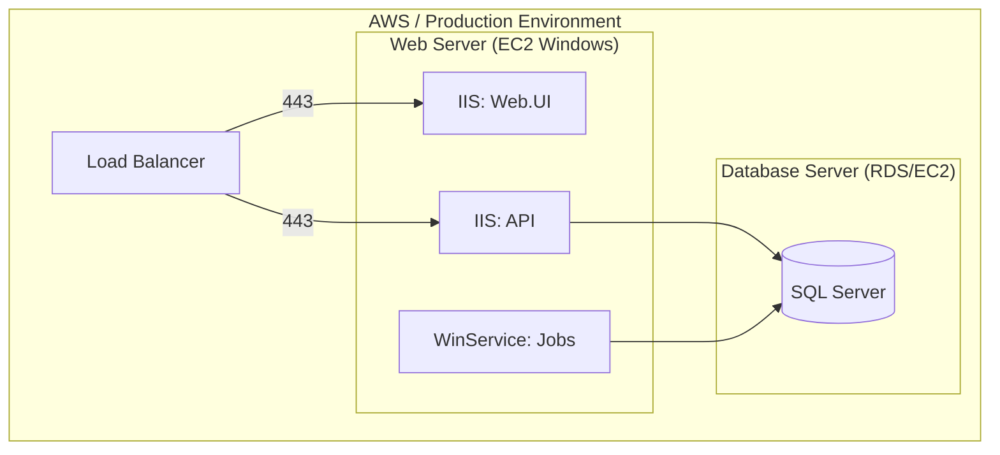

# Marblelife System Architecture

## Overview
The Marblelife Franchise System is a comprehensive enterprise resource planning (ERP) system designed to manage the operations of Marblelife franchises. It handles customer relationship management (CRM), field service scheduling, invoicing, payments, and business intelligence reporting. The system is built on a legacy Microsoft stack (ASP.NET Web API, SQL Server) with an AngularJS frontend.

---

## High-Level Architecture Diagram

```mermaid
graph TB
    subgraph "Client Layer"
        WEB[Web Application (AngularJS)]
    end
    
    subgraph "DMZ / Application Layer"
        IIS[IIS Web Server]
        API[ASP.NET Web API 2]
    end
    
    subgraph "Service Layer"
        CORE[Core Domain Logic]
        INFRA[Infrastructure Services]
        JOBS[Windows Service (Quartz.NET)]
    end
    
    subgraph "Data Layer"
        DB[(SQL Server)]
        RPT[Reporting Engine]
    end
    
    subgraph "External Services"
        AUTHNET[Authorize.Net Gateway]
        REV[ReviewPush API]
        HOME[HomeAdvisor API/Email]
        SMTP[SMTP Server]
    end
    
    WEB -->|HTTPS/JSON| API
    API -->|DI| CORE
    CORE -->|DI| INFRA
    INFRA -->|EF6| DB
    INFRA -->|HTTPS| AUTHNET
    INFRA -->|HTTPS| REV
    
    JOBS -->|Poll| DB
    JOBS -->|IMAP| HOME
    JOBS -->|SMTP| SMTP
```

---

## Technology Stack

### Frontend
| Component | Technology | Version |
|-----------|------------|---------|
| Web Framework | AngularJS | 1.x |
| Build Tools | Gulp, Bower, npm | Legacy |
| Styling | CSS / Bootstrap | 3.x |

### Backend
| Component | Technology | Version |
|-----------|------------|---------|
| Framework | ASP.NET Web API | 2 |
| Language | C# | .NET Framework 4.5+ |
| ORM | Entity Framework | 6 (Code First) |
| DI Container | Unity | 4.x |
| Logging | Log4Net/Custom | - |

### Data
| Component | Technology | Version |
|-----------|------------|---------|
| Database | SQL Server | 2012+ |
| Migration | Custom Tool | `DatabaseDeploy` |

### Infrastructure
| Component | Technology | Version |
|-----------|------------|---------|
| Host | IIS | 8.0+ |
| OS | Windows Server | 2012 R2+ |
| Background Jobs | Windows Service | Quartz.NET |

---

## Service Catalog

This is a monolithic application with logical separation, but it includes distinct deployable units:

| Service | Type | Primary Responsibilities |
|---------|------|-------------------------|
| **MarbleLife.Web** | IIS Site | Hosts the AngularJS Spa and Static Assets. |
| **MarbleLife.API** | IIS App | Hosts the REST API endpoints. |
| **MarbleLife.Jobs** | Windows Service | Runs background tasks: Email dispatch, Recurring Invoices, Lead Polling. |
| **DatabaseDeploy** | Console App | Runs SQL schema migrations and data seeding. |

---

## Deployment Architecture



---

## Communication Patterns

-   **Client-Server**: Synchronous HTTP/HTTPS calls exchanging JSON.
-   **Database Access**: Synchronous blocking calls via Entity Framework (usually wrapped in Repository pattern).
-   **Asynchronous Processing**:
    -   **Email**: The Web App writes to a `Notifications` table. The `Jobs` service polls this table and sends emails via SMTP.
    -   **Leads**: The `Jobs` service polls external email inboxes (HomeAdvisor) and writes to the `MarketingLeads` table.
