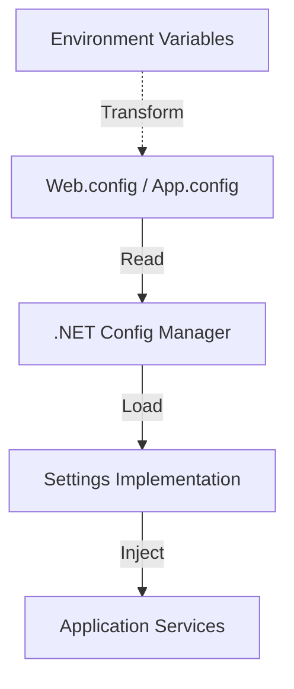

# Marblelife Configurable Design Documentation

## Overview
Configuration in the Marblelife system is primarily managed through standard .NET XML configuration files (`Web.config` for API, `App.config` for Jobs/Console Apps). These settings are accessed via the strongly-typed `ISettings` interface.

---

## Configuration Architecture



---

## Configurable Components

### Database Connection
| Parameter | Key | Description |
|-----------|-----|-------------|
| **Connection String** | `MarbleLifeContext` | The ADO.NET connection string to the SQL Server instance. |

### Feature Flags & Toggles
| Parameter | Key | Default | Description |
|-----------|-----|---------|-------------|
| **Recreate DB** | `RecreateDB` | `False` | **DANGER**: If True, `DatabaseDeploy` will drop and recreate the schema. |
| **Test Mode** | `IsTestMode` | `False` | Used to bypass certain real-world checks (like actual Email sending). |

### External Integrations
| Parameter | Key | Description |
|-----------|-----|-------------|
| **Authorize.Net** | `AuthNetLoginId` | API Login ID for Payment Gateway. |
| **Authorize.Net** | `AuthNetTransactionKey` | Secret Key for Payment Gateway. |
| **Authorize.Net** | `AuthNetSandbox` | `True`/`False`. Determines which endpoint to use. |
| **HomeAdvisor** | `HomeAdvisorEmailUser` | IMAP Username for polling leads. |
| **HomeAdvisor** | `HomeAdvisorEmailPassword` | IMAP Password. |
| **Exchange Rate** | `CurrencyExchangeRateApiKey` | API Key for 3rd party currency service. |
| **ReviewPush** | `ReviewPushApiKey` | API Key for reputation management. |

### File System Paths
| Parameter | Key | Description |
|-----------|-----|-------------|
| **Uploads** | `UploadPath` | Root directory for storing Job Photos and PDFs. |
| **Templates** | `EmailTemplatePath` | Directory containing HTML email templates. |

---

## Configuration Management

### Environment Transformations
The project uses `Web.Release.config`, `Web.Debug.config`, and `Web.QA.config` to transform the base `Web.config` during deployment.
This is where connection strings and API keys are swapped for Production/QA values.

```xml
<!-- Example Transformation -->
<add key="RecreateDB" value="False" xdt:Transform="SetAttributes" xdt:Locator="Match(key)"/>
```

### Best Practices
1.  **Secrets**: Do not commit actual production API keys to source control. Use the Transformation files or CI/CD variable substitution.
2.  **RecreateDB**: Always ensure `RecreateDB` is `False` in Production config transforms.
3.  **Paths**: Use UNC paths or relative paths for ensuring file storage works across multiple web server instances (if load balanced).
