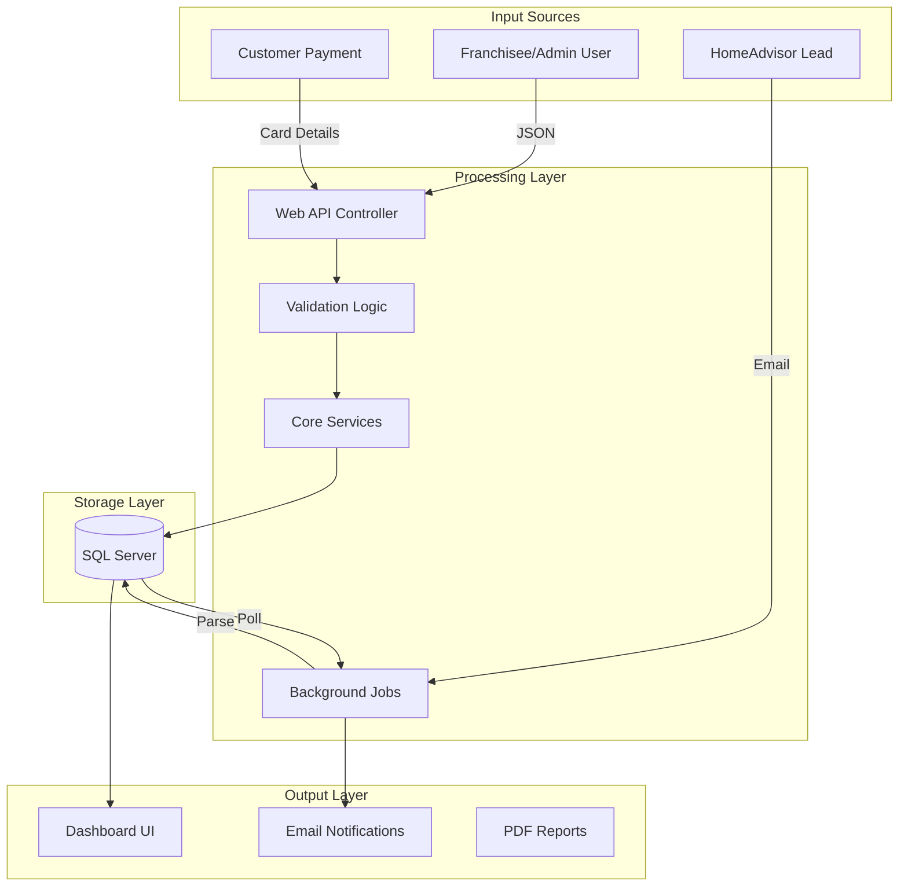
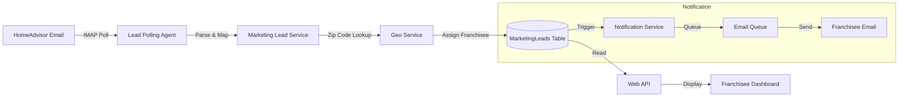
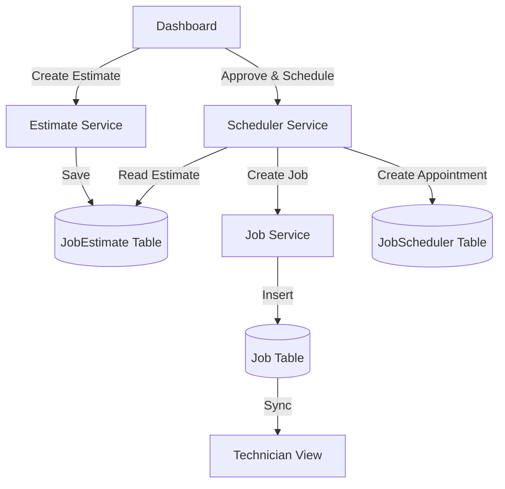
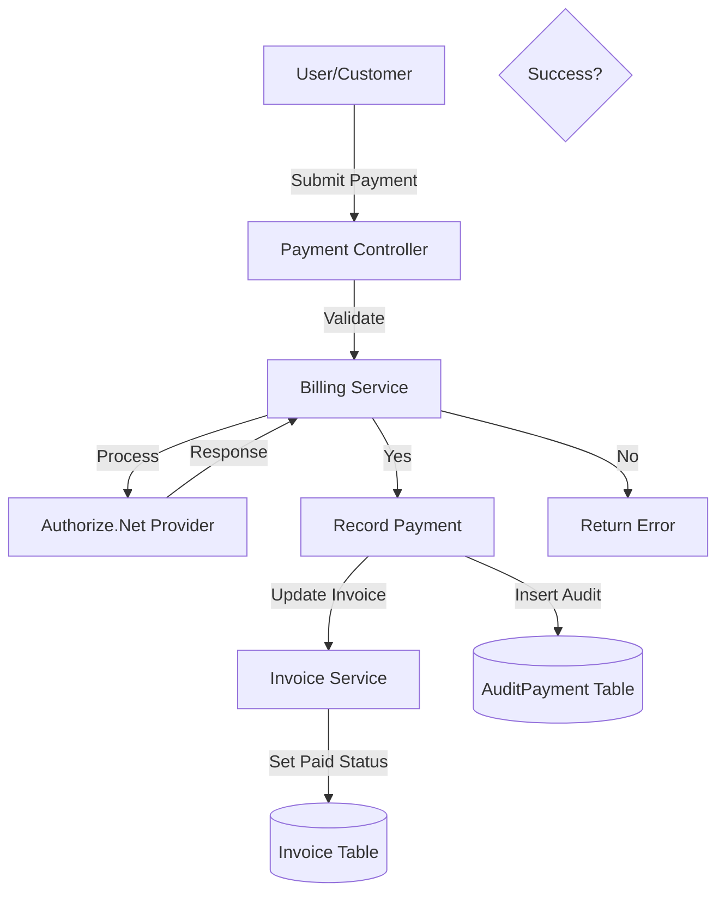

# Marblelife Data Flow Documentation

## Overview
Data flows in the Marblelife system primarily revolve around the lifecycle of a **Franchise Operation**: from Lead Acquisition to Job Execution to Payment Collection. The system acts as a central data hub, synchronizing state between the Database, External APIs, and the User Interface.

---

## High-Level Data Flow

---

## Core Data Flow Scenarios

### 1. New Marketing Lead Flow

Data enters automatically from external sources (HomeAdvisor) or manual entry, and travels to the Franchisee's dashboard.

### 2. Job Estimation & Scheduling Flow

How a lead becomes a scheduled job.

### 3. Payment Processing Flow

How money is collected and recorded.

---

## Data Transformation Pipeline

1.  **Lead Parsing**: Raw HTML emails from HomeAdvisor are parsed using Regex/HtmlAgilityPack to extract Client Name, Phone, and Request Details. These are mapped to the `MarketingLead` domain entity.
2.  **Excel Uploads**: The `CustomerDataUpload` module reads Excel rows, validates them against existing Customer records (fuzzy matching on Name/Address), and transforms them into `FranchiseeSales` records.

---

## Integration Data Flows

### Authorize.Net (Payments)
-   **Direction**: Outbound
-   **Data**: Credit Card Token, Amount, Invoice ID
-   **Protocol**: HTTPS (XML/JSON API)

### ReviewPush (Reputation)
-   **Direction**: Outbound + Inbound
-   **Data**: Customer Email, Location ID -> Request Review
-   **Protocol**: REST API
