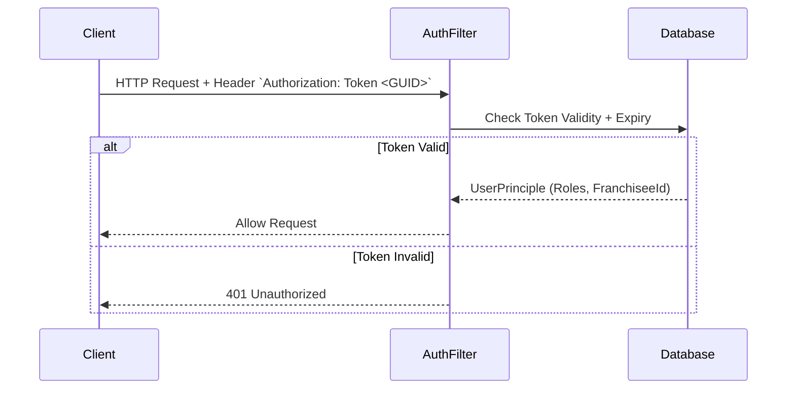

# Marblelife Data Security Documentation

## Overview
This document outlines the security controls, architecture, and policies implemented in the Marblelife Franchise Management System. The system prioritizes data segregation between Franchisees (Multi-Tenancy) and strictly controls access to financial data.

---

## Security Architecture

```mermaid
flowchart TB
    subgraph "Public Internet"
        Client[Browser / Mobile]
    end
    
    subgraph "DMZ / Web Tier"
        LB[Load Balancer / Firewall]
        IIS[IIS Web Server]
    end
    
    subgraph "Safe Zone / Data Tier"
        API[API Application]
        SQL[(SQL Database)]
        Services[Windows Services]
    end
    
    Client -->|HTTPS (443)| LB
    LB --> IIS
    IIS --> API
    API -->|VNET Traffic| SQL
    Services -->|VNET Traffic| SQL
    
    API -.->|No Direct Access| Client
```

---

## Authentication & Authorization

### Authentication Flow (Custom Token)

The system does NOT use OAuth2. It uses a custom HTTP Header based token authentication.



### Role-Based Access Control (RBAC)

Authorization is handled via the `[AuthorizeRole(RoleType)]` attribute on API Controllers.

| Role | Permissions | Scope |
|------|------------|-------|
| `SuperAdmin` | Full Access | Global (All Franchisees) |
| `FranchiseeOwner` | Manage Staff, Finances, Jobs | Private (Own Franchisee Only) |
| `FranchiseeAdmin` | Manage Jobs, Customers | Private (Own Franchisee Only) |
| `Technician` | View Assigned Jobs, Update Work Orders | Assigned Jobs Only |
| `SalesRep` | Create Estimates, View Leads | Private (Own Franchisee Only) |

### Permission Matrix

| Resource | SuperAdmin | FranchiseeOwner | Technician |
|----------|:----------:|:---------------:|:----------:|
| **Franchisee Config** | Read/Write | Read Only | No Access |
| **Staff Users** | Read/Write | Read/Write | Read Self |
| **Invoices** | Read/Write | Read/Write | No Access |
| **Jobs** | Read/Write | Read/Write | Read/Update Status |
| **Reports** | Read/Write | Read/Write | No Access |

---

## Data Encryption

### At Rest
-   **User Passwords**: Salting + Hashing (SHA-256 implementation in `Core.Infrastructure`).
-   **Database**: Recommendation is to enable SQL Server TDE.
-   **Config Files**: `web.config` connection strings should be encrypted using `aspnet_regiis` in production.

### In Transit
-   **HTTPS**: enforced at the IIS/Load Balancer level.
-   **Internal**: SQL traffic is unencrypted by default (assumes secure VNET).

---

## Application Security

### Input Validation
-   **Server-Side**: All API models utilize Data Annotations (`[Required]`, `[StringLength]`) validated by `ModelValidationFilter`.
-   **Client-Side**: AngularJS validation provides immediate feedback but is not trusted.

### SQL Injection Prevention
-   **ORM**: Entity Framework 6 is used for 95% of queries, which parameterizes inputs by default.
-   **Legacy**: Any raw SQL using `ExecuteStoreQuery` must be audited for parameterization.

### Cross-Site Scripting (XSS)
-   **AngularJS**: Automatically sanitizes output bindings.
-   **API**: Returns strictly typed JSON, preventing reflected XSS.

---

## Audit Logging

### Logged Events
1.  **Authentication**: Login Success/Failure (Tracked in `UserLogin` table).
2.  **Financials**: Payment Success/Failure (Tracked in `AuditPayment`, `AuditInvoice`).
3.  **Exceptions**: Stack traces (Tracked in `ErrorLog` table).
4.  **Job Changes**: Status changes (Tracked in `JobStatusHistory`).

### Log Retention
-   **Database Logs**: Indefinite retention for Financial Audits.
-   **File Logs**: Rolling file appender (Log4Net), typically 30 days.
