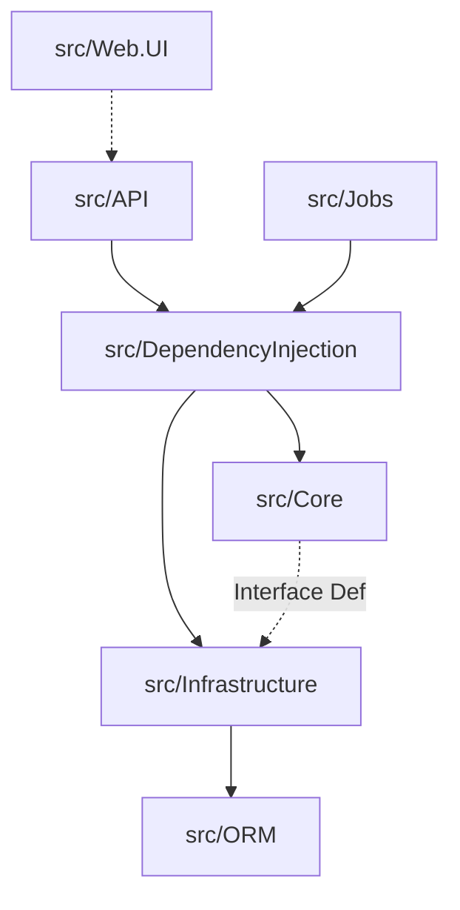

# Marblelife Modules List

## Overview
The solution is organized into a layered architecture with distinct projects for UI, API, Domain Logic, and Infrastructure.

---

## Module Architecture Overview

---

## Application Layers

### 1. Presentation Layer

#### **Web.UI**
-   **Path**: `src/Web.UI`
-   **Type**: Static Website (AngularJS)
-   **Responsibility**: The Single Page Application (SPA) served to the user's browser. Contains all HTML views, JavaScript controllers, and CSS.
-   **Dependencies**: Consumes `src/API`.

#### **API**
-   **Path**: `src/API`
-   **Type**: ASP.NET Web API 2 Project
-   **Responsibility**: Exposes RESTful endpoints, handles Authentication, inputs validation, and orchestrates calls to Core Services.
-   **Key Endpoints**:
    -   `POST /api/Account/Login`: Authenticate user.
    -   `GET /api/Dashboard`: Fetch KPI data.
    -   `POST /api/Payment/Process`: Hande transactions.

### 2. Service Layer (Core)

#### **Core**
-   **Path**: `src/Core`
-   **Type**: Class Library
-   **Responsibility**: The heart of the system. Contains Domain Entities, Service Interfaces, and Business Logic.
-   **Sub-Modules**:
    -   `Core.Billing`: Financial logic.
    -   `Core.Organizations`: Franchisee hierarchy.
    -   `Core.Scheduler`: Job scheduling.
    -   `Core.Sales`: CRM.
    -   `Core.Notification`: Email logic.

#### **Jobs**
-   **Path**: `src/Jobs`
-   **Type**: Windows Service Application
-   **Responsibility**: Asynchronous background processing.
-   **Key Jobs**:
    -   `EmailDispatchJob`: Sends queued emails.
    -   `LeadPollingJob`: Ingests leads from POP3/IMAP.
    -   `LateFeeJob`: Applies penalties to overdue invoices.

### 3. Infrastructure Layer

#### **Infrastructure**
-   **Path**: `src/Infrastructure`
-   **Type**: Class Library
-   **Responsibility**: Implements interfaces defined in `Core`. Handles external concerns like File I/O, Third-party APIs, and specific algorithms.
-   **Components**:
    -   `AuthorizeNetPaymentService`: Gateway integration.
    -   `Log4NetLogger`: Logging implementation.

#### **ORM**
-   **Path**: `src/ORM`
-   **Type**: Class Library
-   **Responsibility**: Data Access Layer using Entity Framework 6. Defines the `DbContext` and Entity Mappings.

#### **DependencyInjection**
-   **Path**: `src/DependencyInjection`
-   **Type**: Class Library
-   **Responsibility**: Configuration of the Unity IoC Container. Wires up Interfaces to Implementations.

---

## Tooling Modules

| Module | Type | Responsibility |
|--------|------|----------------|
| **DatabaseDeploy** | Console App | Runs custom SQL migration scripts to update the DB schema. |
| **FranchiseeMigration** | Console App | Seeds initial hardcoded Franchisee data. |
| **CustomerDataUpload** | Console App | Utility for bulk Excel imports of customer lists. |
| **CalendarImportService** | Console App | Prototype for parsing `.ics` calendar files. |

---

## Database Dependencies

Central Relational Database (SQL Server).

| Module | Access Type | Primary Tables |
|--------|-------------|----------------|
| **Core.Billing** | Read/Write | `Invoices`, `Payments`, `Audit*`, `ChargeCards` |
| **Core.Organizations** | Read/Write | `Franchisees`, `OrganizationRoleUsers`, `Persons` |
| **Core.Scheduler** | Read/Write | `Jobs`, `JobEstimates`, `JobScheduler`, `WorkOrders` |
| **Core.Sales** | Read/Write | `Customers`, `MarketingLeads`, `SalesDataUploads` |
| **Core.Notification** | Read/Write | `Notifications`, `EmailLogs` |
