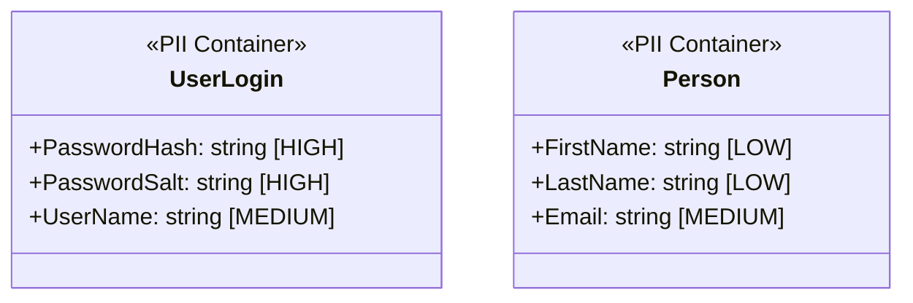
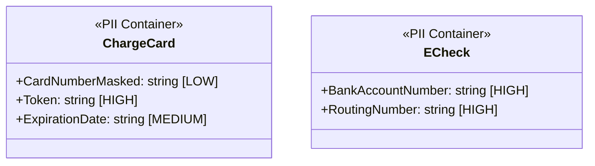
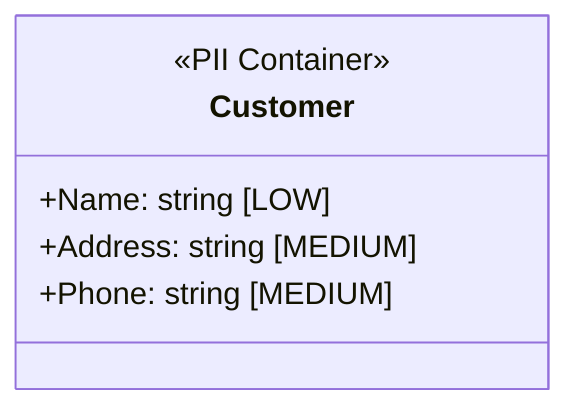

# Marblelife PII Data Documentation

## Overview
The Marblelife system processes significant Personally Identifiable Information (PII) related to Franchisee Owners, Technicians, Homeowners (Customers), and configured Leads. All sensitive financial data is tokenized via Authorize.Net, but personal contact information is stored in the application database.

---

## PII Classification Levels

| Level | Description | Examples | Protection Requirements |
|-------|-------------|----------|------------------------|
| **HIGH** | Strict Confidentiality | Password Hashes, Credit Card Tokens, Social Security Numbers (EIN) | Encrypted at Rest, Masked in Logs, Restricted Access |
| **MEDIUM** | Private Personal Info | Home Addresses, Personal Phone Numbers, Email Addresses, Salary/Commission Rates | Access Control (Role Based), TLS in Transit |
| **LOW** | Business Public Info | Franchisee Business Address, Business Phone, Names | TLS in Transit |

---

## PII Data Inventory

### 1. User Credentials & Identity



| Field | Classification | Storage | Encryption | Masking |
|-------|---------------|---------|------------|---------|
| `UserLogin.Password` | HIGH | SQL (`UserLogins`) | One-Way Hash (SHA) | NEVER DISPLAY |
| `Person.Email` | MEDIUM | SQL (`Persons`) | None | None |

### 2. Customer Financials



| Field | Classification | Storage | Encryption | Masking |
|-------|---------------|---------|------------|---------|
| `ChargeCard.Token` | HIGH | SQL (`ChargeCard`) | None (Opaque Token) | N/A |
| `ECheck.AccountNumber` | HIGH | SQL (`ECheck`) | **Required** (Verify implementation) | Display Last 4 |

### 3. Customer CRM Data



---

## Data Flow Map with PII Indicators

```mermaid
flowchart TB
    USER[Homeowner] -->|Input PII| WEB[Web Form]
    WEB -->|TLS| API[Web API]
    
    API -->|Sanitize| LOGS[Logs (Masked)]
    
    API -->|Store Full| DB[(Database)]
    
    API -->|Send Token| GATEWAY[Auth.Net]
    GATEWAY -->|Return Token| API
    
    DB -->|Read PII| ADMIN[Franchisee Admin]
    DB -->|Read PII| TECH[Technician]
```

---

## Protection Measures

### Encryption
-   **In Transit**: All HTTP traffic must be secured via TLS 1.2+ (Enforced by IIS bindings).
-   **At Rest**: SQL Server TDE (Transparent Data Encryption) is recommended for production environments containing Card Tokens and EINs.

### Access Controls
-   **Role-Based Access**:
    -   `Technician`: Can only see Customers assigned to their active Jobs.
    -   `FranchiseeAdmin`: Can see all Customers within their Franchise.
    -   `SysAdmin`: Full access.

### Data Retention
-   **Leads**: Retained indefinitely for historical reporting.
-   **Invoices**: Retained for >7 years for tax compliance.
-   **Logs**: Rotated every 30-90 days via Log4Net configuration.

## Compliance Requirements
-   **PCI-DSS**: System handles Credit Card Tokens. Do not store Raw PAN (Primary Account Number). Ensure `ChargeCard` table only stores tokens/masks.
