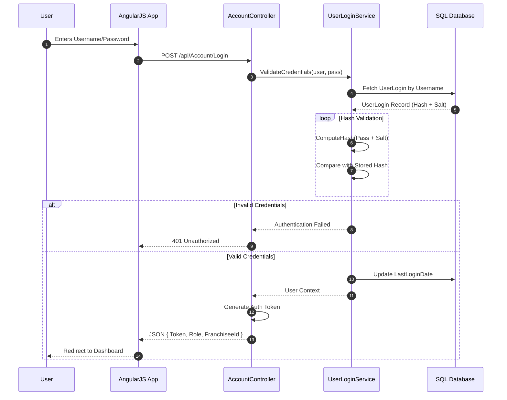
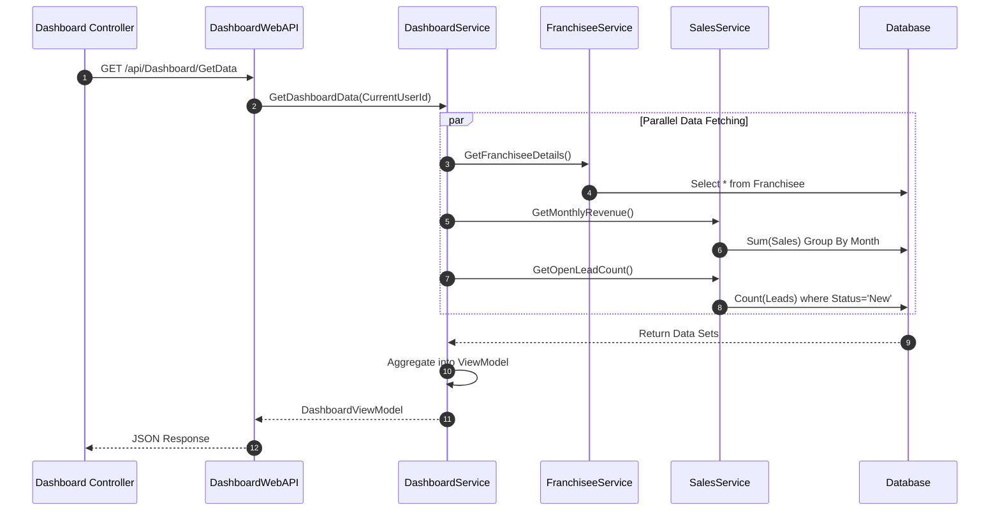
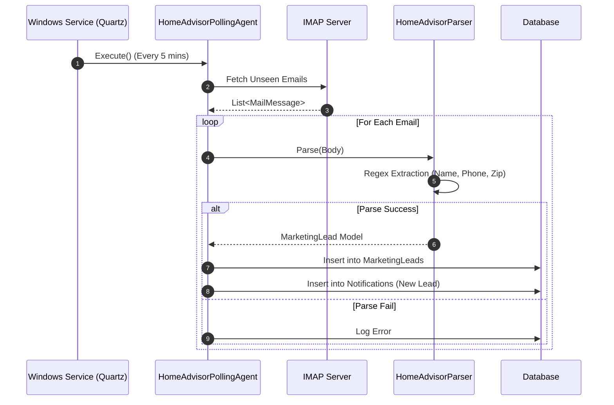
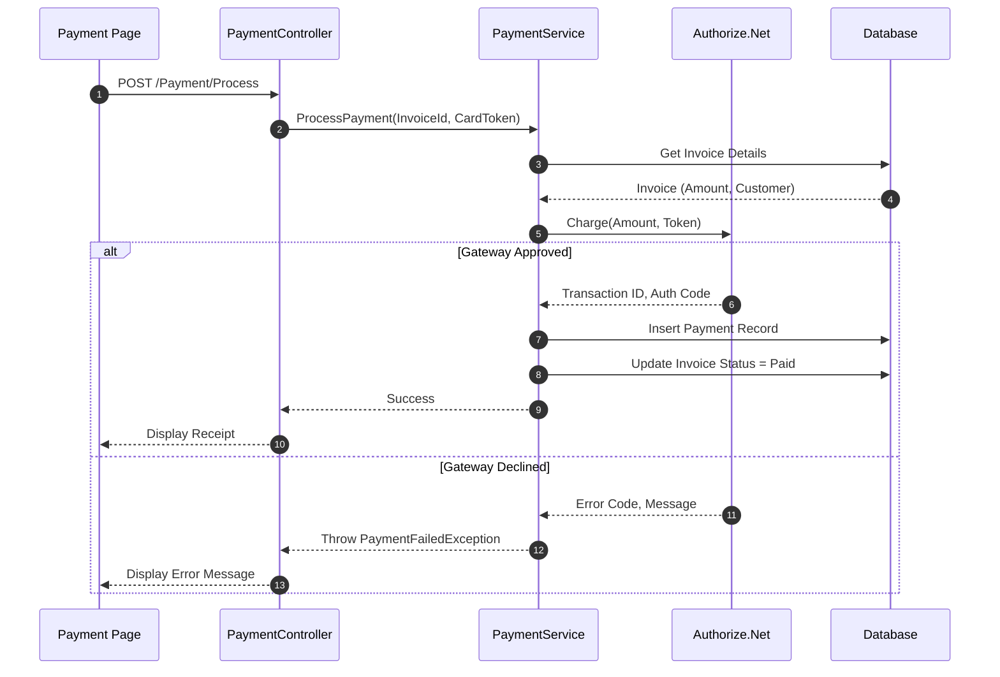
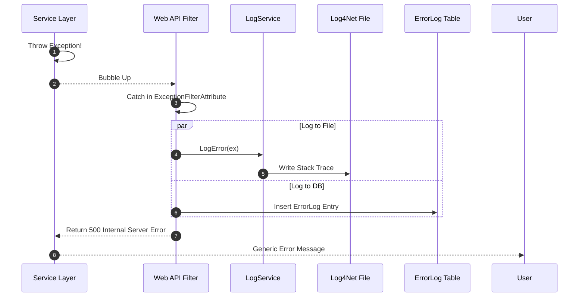

# Marblelife Sequence Diagrams

## Overview
This document details the interaction sequences for critical system workflows, highlighting the interplay between the AngularJS frontend, the Web API, the Core Services, and External Providers.

---

## 1. Authentication Flow

The system uses a custom token/hash based authentication mechanism rather than standard ASP.NET Identity or OAuth 2.0.

## 2. Global Dashboard Data Load

Fetching the KPIs for the main Franchisee Dashboard.

## 3. Background Lead Ingestion

How emails become leads without user interaction.

## 4. Payment Transaction Flow

Processing a Credit Card payment for an Invoice.

## 5. Error Handling & Logging Flow

What happens when code throws an exception.

